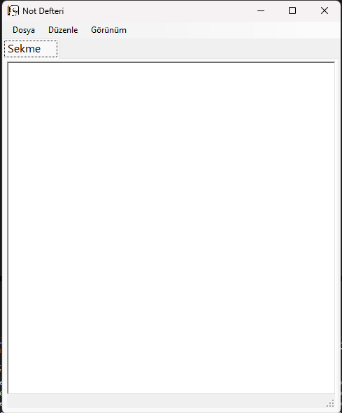
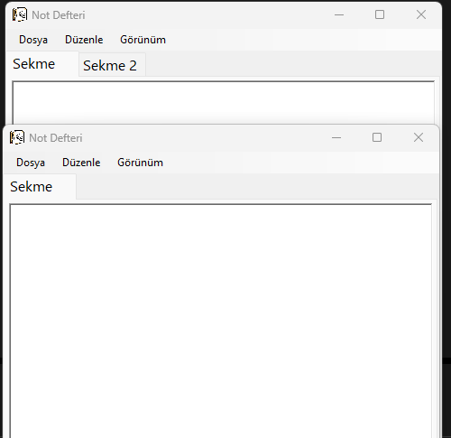
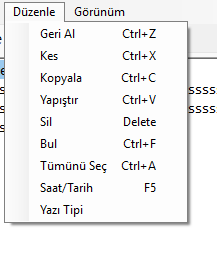
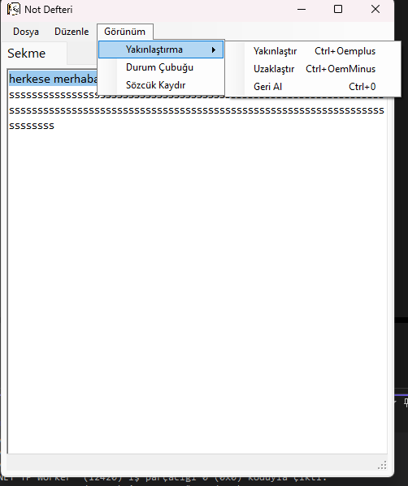

# NotDefteri-Uygulamasi

Bu proje, C# ve Windows Forms kullanılarak geliştirilmiş, sekmeli yapıya sahip bir Not Defteri uygulamasıdır. Kullanıcıların metin düzenleme ihtiyaçlarını kolaylaştırmak için temel ofis yazılımlarında bulunan birçok özellik eklenmiştir.

## Özellikler

- Yeni sekme oluşturma (Ctrl+N)
- Dosya açma, kaydetme, kapatma
- Kes, kopyala, yapıştır, geri al işlevleri
- Bul ve tüm metni seç özellikleri
- Saat/Tarih ekleme
- Yazı tipi ayarlama ve yakınlaştırma/uzaklaştırma
- Durum çubuğu ve sözcük kaydırma özellikleri
  
## Teknolojiler

- **C#**
- **.NET Framework**
- **Windows Forms**
  

## Uygulama Kurulumu

Not Defteri Uygulamasını indirmek için aşağıdaki adımları takip edebilirsiniz:

1. [**Not Defteri Uygulamasını İndir**](NotDefteri.zip) linkine tıklayın.
2. **.application** dosyasını çalıştırın.
3. Uygulama yüklenecektir.

### Kurulum Detayları
Uygulama, **ClickOnce** kullanılarak yayımlandı, bu nedenle güncellemeler otomatik olarak yapılacaktır.

